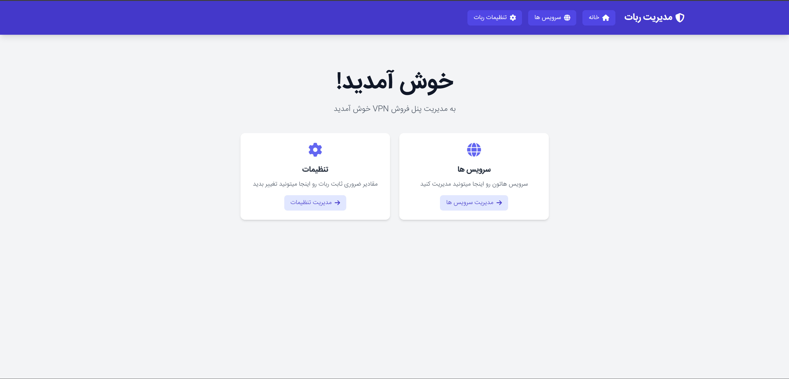

# 🛡️ 404Vpn - ربات فروش VPN + پنل مدیریت

پروژه‌ی **404Vpn** یک ربات فروش VPN به همراه یک **پنل مدیریت تحت وب** است که با هدف مدیریت آسان کاربران، پلن‌ها و سرویس‌های VPN طراحی شده است. این سیستم به مدیران کمک می‌کند تا بدون نیاز به ارتباط مستقیم با کاربران، فرآیند فروش، تمدید و مدیریت سرویس‌ها را به‌صورت خودکار انجام دهند.

## ✨ ویژگی‌ها

- فروش خودکار سرویس VPN با قابلیت پرداخت اعتباری (Wallet)
- مدیریت پلن‌ها از طریق پنل تحت وب
- تمدید و افزایش حجم سرویس توسط کاربر
- ساختار چندلایه با معماری تمیز (Clean Architecture)

## ⚙️ تکنولوژی‌های استفاده شده

- **C# (.NET 8)** – برای توسعه هسته پروژه و API
- **ASP.NET Core Web API** – برای ساخت پنل مدیریت و درگاه ارتباطی با ربات
- **Entity Framework Core** – برای ارتباط با پایگاه داده PostgreSQL
- **PostgreSQL** – پایگاه داده اصلی پروژه
- **Telegram.Bot** – برای ارتباط با Bot API تلگرام
- **MemoryCache** – برای افزایش عملکرد با ذخیره‌ی تنظیمات و پیام‌ها در حافظه
- **Clean Architecture** – تفکیک لایه‌ها برای خوانایی و مقیاس‌پذیری بالا

## 📷 پیش‌نمایش پنل مدیریت

> برای مشاهده پنل به‌صورت کامل، به مسیر `UI.Web/` در پروژه مراجعه کنید.

## 📌 وضعیت پروژه

پروژه در حال توسعه است و برخی از بخش‌ها هنوز تکمیل نشده‌اند. به‌زودی قابلیت‌های جدید و مستندات بیشتر به آن اضافه خواهد شد.

## 📬 ارتباط با من

در صورت هرگونه سوال، پیشنهاد یا همکاری می‌توانید از طریق بخش Issues یا پیام در GitHub با من در ارتباط باشید.

---

© 2024 - Reza Tork | 404Vpn
